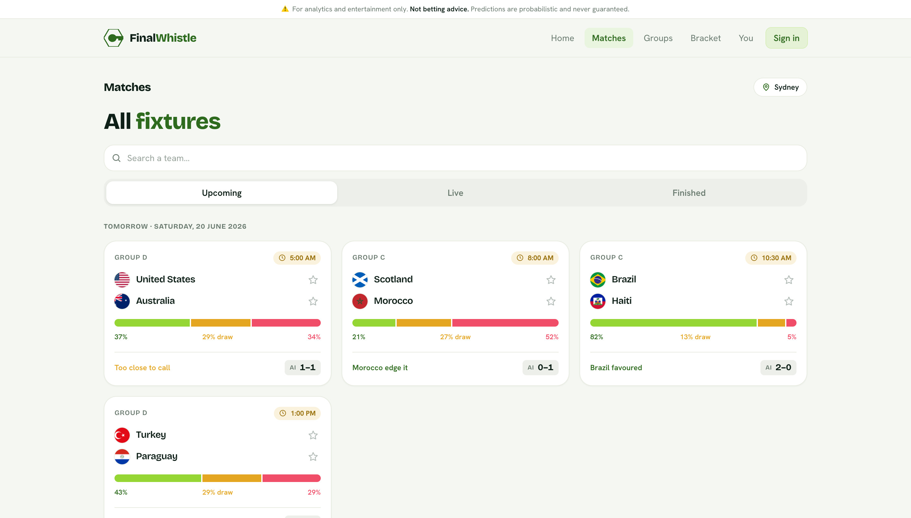
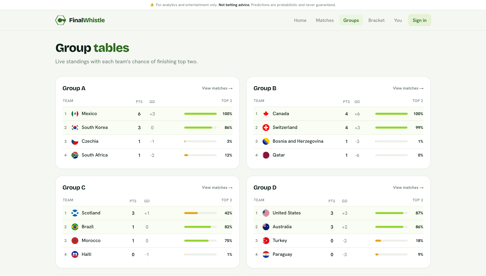
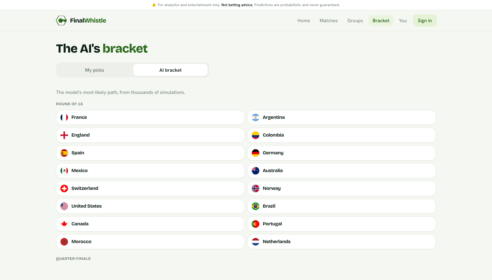
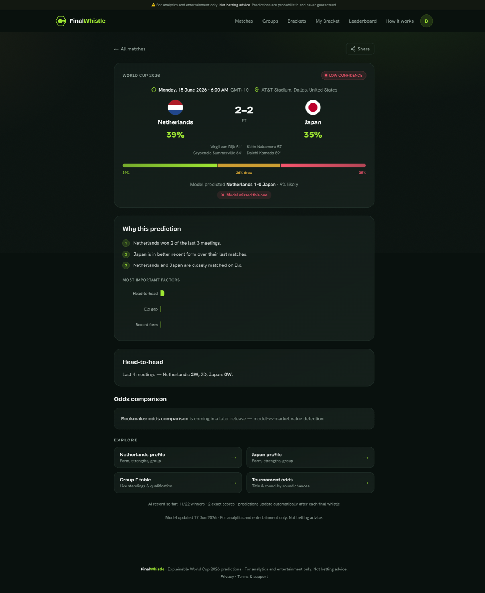

<div align="center">

# ⚽ FinalWhistle

### Explainable AI for the FIFA World Cup 2026

Match odds, predicted scorelines, live in-match win probabilities, full-tournament
Monte-Carlo simulation, a bracket-prediction game, and a public leaderboard —
and it tells you **why** for every prediction.

[](https://fifa-wc26-prediction.vercel.app)
&nbsp;
[](https://pitchprophet-api.onrender.com/api/health)

[](https://github.com/javohir73/fifa-wc26-prediction/actions/workflows/ci.yml)
[](#-engineering--quality)
[](LICENSE)


**[🌍 Open the live app →](https://fifa-wc26-prediction.vercel.app)**

<sub>⚠️ For analytics, research, and entertainment only. **Not betting advice.** Predictions are probabilistic and never guaranteed.</sub>

</div>

---

**FinalWhistle** is a full, deployed prediction platform for the 2026 World Cup — not a notebook
and not a demo. A statistical engine (Elo → Dixon-Coles Poisson → Monte-Carlo) rates every nation,
predicts every fixture, and simulates the whole tournament thousands of times a day. A Next.js
front end turns that into live match odds, group tables, a road-to-the-final view, and a bracket
game you can play against the model — each prediction backed by a plain-English "why", a
feature-importance breakdown, and a published, backtested accuracy record.

<div align="center">

</div>

---

## ✨ What it does

### 🎯 Predictions you can read
- **Win / draw / loss probabilities** for every match, with a **confidence** badge (High / Medium / Low).
- **Predicted scorelines** — an actual most-likely score, not just an outcome — from a Dixon-Coles bivariate Poisson model.
- **Live in-match win probabilities** that update as the score and clock change during a game.

### 🧩 Explainable by design
- A **"Why this prediction"** panel: the human-readable reasons behind each call (recent form, head-to-head, Elo gap, host advantage).
- A **feature-importance** chart showing how much each factor moved the number.
- A public **[methodology & accuracy page](https://fifa-wc26-prediction.vercel.app/methodology)** with a reliability/calibration curve and a leak-free backtest.

### 🏆 Whole-tournament intelligence
- **Group standings** projected from thousands of Monte-Carlo runs, with **qualification odds** per team — and a **LIVE** badge on any group with a match in progress.
- **Title & stage odds** ("Road to the Final"): each nation's chance of reaching the R32 → R16 → QF → SF → Final → lifting the trophy.
- **Projected bracket** from the official 2026 format (12 groups + the 8 best third-placed teams), with a penalty-shootout model for knockout ties.

### 🎮 Explore
- **Bracket** — the official knockout bracket alongside the AI's projected path to the final.

<table>
<tr>
<td width="33%"><br><sub><b>Group standings</b> — projected tables, qualification odds, LIVE badges</sub></td>
<td width="33%"><br><sub><b>Road to the Final</b> — title & stage odds from full-tournament sims</sub></td>
<td width="33%"><br><sub><b>Bracket</b> — official results and the AI's projected path</sub></td>
</tr>
</table>

### 🔍 Every prediction, explained

<div align="center">

</div>

---

## 🧠 How it works

Predictions are **precomputed by a pipeline** and served from cache — the front end never triggers a
model run. A daily job (plus a fast live-score poll during matches) keeps everything current.

```
  49k internationals (since 1872)
       │
       ▼
  Elo ratings ──► Dixon-Coles Poisson ──► calibration ──► Monte-Carlo sims
   strength &       expected goals &      temperature /    groups + knockouts →
   host bonus       scoreline grid        vector scaling   qual / stage / title odds
```

1. **Elo strength ratings** — every international since 1872 is replayed in date order (K-factor by competition, margin-of-victory multiplier, home/host advantage). Cold-start teams fall back to FIFA rank → confederation average.
2. **Dixon-Coles bivariate Poisson** — turns the Elo gap into expected goals and a full grid of scoreline probabilities (with the Dixon-Coles low-score correction).
3. **Calibration** — probabilities are temperature/vector-scaled against a validation set so that *"60% means it happens ~60% of the time."*
4. **Monte-Carlo simulation** — thousands of runs play out all 72 group matches, seed the official Round-of-32 bracket, and decide knockout ties (penalty-shootout model) to produce qualification, stage, and title odds.

### 📊 Backtested, honestly

Replayed leak-free against **World Cups 2018 + 2022** (128 matches). Lower log-loss / Brier is better.

| Predictor | Log-loss | Brier | Accuracy |
|---|:---:|:---:|:---:|
| **FinalWhistle model** | **1.018** | **0.599** ✅ best | **54.7%** |
| favorite-rate baseline | 1.006 | 0.600 | 54.7% |
| literal favorite (60/25/15) | 1.027 | 0.609 | 54.7% |
| base-rate (ignores teams) | 1.084 | 0.660 | 41.4% |

The model **clearly beats** the naive baselines on log-loss (every year) and has the **best Brier
score of any predictor**. It's a hair behind the *sophisticated* favorite-rate baseline on pooled
log-loss (1.018 vs 1.006) — entirely due to **2022**, a famously upset-heavy tournament (Saudi
Arabia over Argentina, Japan over Germany & Spain, Morocco to the semis), where knowing the *size*
of a favorite's edge actually hurt. In the form-true 2018 cup it beats every baseline. The
calibration curve sits near the diagonal — the model is already well-calibrated (it picks
temperature ≈ 0.95, almost identity).

Reproduce it yourself:

```bash
PYTHONPATH=backend:. .venv/bin/python -m pipeline.run_backtest
```

See **[docs/methodology.md](docs/methodology.md)** for the full write-up.

---

## 🏗️ Architecture

```
   Next.js (Vercel)  ──REST──►  FastAPI (Render)  ──►  PostgreSQL
   match odds, groups,          serves precomputed     (source of truth)
   brackets, live UI            predictions from cache         ▲
                                        ▲                      │
                                        └── scheduled pipeline (GitHub Actions cron)
                                            fetch data → Elo → predict → simulate → store
                                            + live-score poll during matches
```

- **Frontend → Vercel** (Next.js App Router, polls for live updates).
- **Backend + Postgres + cron → Render** (FastAPI, via the `render.yaml` blueprint).
- **Live scores** from API-Football (football-data.org fallback); **historical results** from an open ~49k-match international dataset.

## 🧰 Tech stack

| Layer | Tech |
|---|---|
| **Frontend** | Next.js (TypeScript, App Router), Tailwind CSS, Recharts |
| **Backend** | Python 3.12, FastAPI, SQLAlchemy, Alembic |
| **ML / Stats** | NumPy, pandas, scikit-learn — Elo, Dixon-Coles Poisson, probability calibration, Monte-Carlo simulation |
| **Database** | PostgreSQL |
| **Data** | API-Football / football-data.org (live), open historical results dataset (~49k matches) |
| **Infra** | Vercel (web), Render (API + DB + cron), GitHub Actions (CI + scheduled refresh) |
| **Tests** | pytest (Python) + Jest / React Testing Library (frontend) |

## 🔬 Engineering & quality

- **450+ automated tests** — **316** Python (`pytest`) across backend, ML, and pipeline; **138** frontend (`Jest`/RTL). CI runs both suites and blocks merges on failure.
- **Leak-free backtesting** — Elo is replayed strictly in date order; features are computed *before* a match result is folded in.
- **Calibration gates** — a calibration candidate only ships if it beats the production model on held-out log-loss; otherwise the model stays uncalibrated rather than guessing.
- **Self-healing live state** — a match only reads as "LIVE" if the feed says in-play *and* it kicked off recently, so a stalled feed can't leave a game stuck on "LIVE" for hours.
- **Audited record** — a `/api/model/record` endpoint exposes the model's running tournament accuracy (winner hit-rate, exact scores, Brier, calibration).

---

## 🚀 Run it locally

<details>
<summary><b>Quick start</b> (Python 3.12+, Node 20+, Docker)</summary>

```bash
# 1. Environment files
cp .env.example .env
echo "NEXT_PUBLIC_API_URL=http://localhost:8000" > frontend/.env.local

# 2. Install (Python venv + frontend deps)
make install

# 3. Postgres
docker compose up -d

# 4. Migrations
cd backend && PYTHONPATH=. ../.venv/bin/alembic upgrade head && cd ..

# 5. Load data + build predictions (downloads ~49k historical results)
PYTHONPATH=backend:. .venv/bin/python -m pipeline.run_pipeline

# 6. Backend → http://localhost:8000
PYTHONPATH=backend:. .venv/bin/uvicorn app.main:app --reload

# 7. Frontend → http://localhost:3000
cd frontend && npm run dev
```

Run the tests anytime with `make test` (both suites), or `make test-py` / `make test-js`.

Full deploy instructions and the env-var reference live in **[DEPLOYMENT.md](DEPLOYMENT.md)**.

</details>

### Repository layout

```
backend/    FastAPI app, ORM models, API routers, scoring
ml/         prediction engine — Elo, Poisson/Dixon-Coles, calibration, simulation, explainability
pipeline/   data ingestion (historical + live), scheduled orchestration, backtest harness
frontend/   Next.js app (matches, groups, brackets, leaderboard, methodology)
docs/       methodology & accuracy write-up
tasks/      product spec + build plan
```

---

## 🗺️ Roadmap

Shipped and live: match odds · scorelines · live win probabilities · group standings + LIVE badges ·
qualification/title/stage odds · projected bracket · bracket game · leaderboard · explainability · calibration.

Next up:
- **Goalscorer predictions** (per-match scorer likelihoods)
- **Gradient-boosted W/D/L challenger** (gated — ships only if it beats the current model on the backtest)
- **Live Elo adjustments** during matches

---

## ⚠️ Disclaimer

FinalWhistle is for **analytics, research, and entertainment only**. It is **not betting advice**.
All outputs are probabilistic and never guaranteed.

## 📄 License

[Apache License 2.0](LICENSE).
